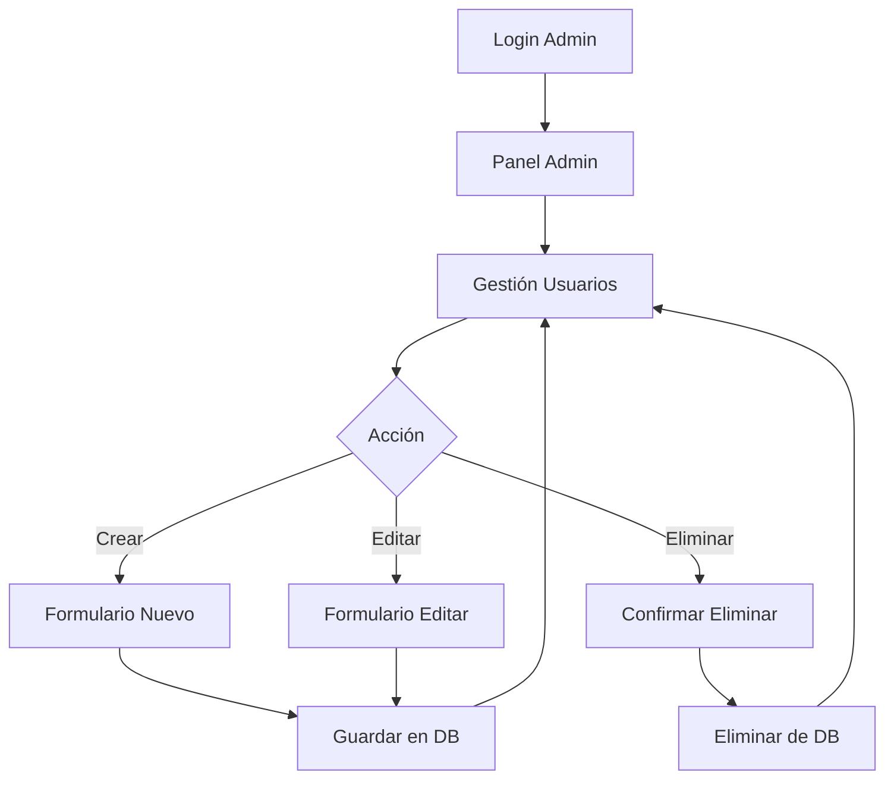

# 🎯 CRUD de Usuarios - Guía Completa

## ✅ Funcionalidades Implementadas

### 1️⃣ **LISTAR USUARIOS** (`/admin/usuarios`)
- ✅ Tabla con todos los usuarios registrados
- ✅ Muestra: ID, Nombre, Correo, Rol
- ✅ Badges de colores según el rol:
  - 🔴 ADMINISTRADOR (Rojo)
  - 🔵 ORGANIZADOR (Azul)
  - 🟢 EXPOSITOR (Verde)
  - 🟡 EVALUADOR (Amarillo)
  - ⚫ VISITANTE (Gris)
- ✅ Contador de usuarios totales
- ✅ Mensajes de éxito/error con alertas

---

### 2️⃣ **CREAR USUARIO** (`/admin/usuarios/nuevo`)
- ✅ Formulario con diseño moderno y profesional
- ✅ Campos:
  - Nombre completo (requerido)
  - Correo electrónico (requerido, validación de formato)
  - Rol (requerido, selector con iconos)
  - Contraseña (requerido, mínimo 6 caracteres)
- ✅ Validación en tiempo real
- ✅ Iconos visuales en cada campo
- ✅ Validación de correo duplicado
- ✅ Mensajes de error/éxito

---

### 3️⃣ **EDITAR USUARIO** (`/admin/usuarios/editar/{id}`)
- ✅ Reutiliza el mismo formulario de crear
- ✅ Carga los datos del usuario seleccionado
- ✅ Permite modificar todos los campos
- ✅ Validación de correo duplicado (excepto el mismo usuario)
- ✅ Icono cambia a lápiz de edición
- ✅ Título dinámico "Editar Usuario"

---

### 4️⃣ **ELIMINAR USUARIO** (`/admin/usuarios/eliminar/{id}`)
- ✅ Confirmación con diálogo JavaScript
- ✅ Elimina el usuario de la base de datos
- ✅ Mensaje de confirmación
- ✅ Manejo de errores si el usuario no existe
- ✅ Redirección automática a la lista

---

## 🎨 Características de Diseño

### 🌈 Interfaz Visual
- Diseño moderno con gradientes
- Animaciones suaves en botones
- Validación visual (verde/rojo)
- Responsive (funciona en móviles)
- Bootstrap 5 + Bootstrap Icons
- Formas flotantes decorativas

### 🔔 Notificaciones
- ✅ Alertas de éxito (verde)
- ❌ Alertas de error (rojo)
- ℹ️ Mensajes contextuales
- 🚫 Validaciones en tiempo real

---

## 🚀 Cómo Usar el CRUD

### **Acceso**
1. Inicia sesión como ADMINISTRADOR
2. Vas automáticamente a `/admin/panelAdmin`
3. Haz clic en "Gestión de Usuarios"

---

### **Crear Usuario**
1. En `/admin/usuarios` haz clic en **"Nuevo Usuario"** (botón verde)
2. Completa el formulario:
   ```
   Nombre: Juan Pérez
   Correo: juan@example.com
   Rol: Organizador
   Contraseña: 123456
   ```
3. Haz clic en **"Guardar Usuario"**
4. Verás mensaje: "Usuario guardado correctamente"

---

### **Editar Usuario**
1. En la tabla de usuarios, busca el usuario a editar
2. Haz clic en el botón **"Editar"** (amarillo) 
3. Modifica los campos necesarios
4. Haz clic en **"Guardar Usuario"**
5. Verás mensaje: "Usuario guardado correctamente"

---

### **Eliminar Usuario**
1. En la tabla de usuarios, busca el usuario a eliminar
2. Haz clic en el botón **"Eliminar"** (rojo)
3. Confirma en el diálogo: "¿Está seguro de eliminar este usuario?"
4. El usuario será eliminado
5. Verás mensaje: "Usuario eliminado correctamente"

---

## 🔐 Validaciones Implementadas

### En el Formulario (Frontend)
- ✅ Nombre: Requerido, mínimo 1 carácter
- ✅ Correo: Requerido, formato email válido
- ✅ Rol: Requerido, debe seleccionar uno
- ✅ Contraseña: Requerido, mínimo 6 caracteres
- ✅ Validación en tiempo real (al escribir)
- ✅ Indicadores visuales (verde/rojo)

### En el Backend (Controller)
- ✅ Correo único (no duplicados)
- ✅ Excepción si el correo ya existe
- ✅ Manejo de errores con try-catch
- ✅ Mensajes flash para feedback
- ✅ Validación antes de guardar

---

## 📂 Archivos Modificados

### **Controller**
```
AdminController.java
├── @GetMapping("/admin/usuarios") - Listar
├── @GetMapping("/admin/usuarios/nuevo") - Formulario crear
├── @GetMapping("/admin/usuarios/editar/{id}") - Formulario editar
├── @PostMapping("/admin/usuarios/guardar") - Guardar (crear/editar)
└── @GetMapping("/admin/usuarios/eliminar/{id}") - Eliminar
```

### **Vistas HTML**
```
/admin/usuarios.html - Lista con tabla
/admin/nuevoUsuario.html - Formulario crear/editar
/admin/panelAdmin.html - Dashboard admin
```

---

## 🧪 Pruebas Sugeridas

### ✅ Caso 1: Crear Usuario Exitoso
```
Nombre: María García
Correo: maria@test.com
Rol: Expositor
Contraseña: 123456
Resultado: ✅ Usuario creado
```

### ✅ Caso 2: Correo Duplicado
```
Correo: admin@expogest.com (ya existe)
Resultado: ❌ Error "El correo ya está registrado"
```

### ✅ Caso 3: Editar Usuario
```
1. Editar usuario con ID: 674a...
2. Cambiar nombre a "Juan Editado"
3. Guardar
Resultado: ✅ Usuario actualizado
```

### ✅ Caso 4: Eliminar Usuario
```
1. Seleccionar usuario
2. Clic en Eliminar
3. Confirmar
Resultado: ✅ Usuario eliminado
```

---

## 🎯 Endpoints del CRUD

| Método | Endpoint | Descripción |
|--------|----------|-------------|
| GET | `/admin/usuarios` | Lista todos los usuarios |
| GET | `/admin/usuarios/nuevo` | Formulario crear usuario |
| GET | `/admin/usuarios/editar/{id}` | Formulario editar usuario |
| POST | `/admin/usuarios/guardar` | Guarda usuario (crear/editar) |
| GET | `/admin/usuarios/eliminar/{id}` | Elimina usuario |

---

## 🔄 Flujo de Trabajo



---

## ⚠️ Notas Importantes

1. **Rol Converter**: Se implementó un convertidor personalizado que transforma:
   - "Administrador" → `Usuario.Rol.ADMINISTRADOR`
   - "Organizador" → `Usuario.Rol.ORGANIZADOR`
   - etc.

2. **Contraseñas**: Actualmente se guardan en texto plano
   - ⚠️ Para producción: Implementar BCrypt o similar

3. **Autenticación**: Sin JWT actualmente
   - ⚠️ Para producción: Implementar JWT tokens

4. **Autorización**: Security configurado en `permitAll()`
   - ⚠️ Para producción: Restringir rutas `/admin/**` solo a ADMINISTRADOR

---

## 🎉 Estado del Sprint 1

### ✅ Completado al 100%
- [x] Configuración Spring Boot + MongoDB
- [x] API REST para registro/login
- [x] Sistema de roles (5 roles)
- [x] CRUD completo de usuarios (Admin)
- [x] Interfaz web funcional
- [x] Validaciones frontend y backend
- [x] Diseño moderno y profesional
- [x] Mensajes de feedback
- [x] Manejo de errores

---

## 🚀 Próximos Pasos (Sprint 2)

1. Implementar JWT para autenticación
2. Agregar autorización por roles en rutas
3. Implementar solicitudes de stand (Expositor)
4. Sistema de evaluaciones (Evaluador)
5. Hash de contraseñas con BCrypt
6. Paginación en lista de usuarios
7. Búsqueda y filtros de usuarios
8. Exportar usuarios a Excel/PDF

---

## 📞 Soporte

Si encuentras algún error o necesitas ayuda:
1. Verifica que la aplicación esté corriendo en `localhost:8115`
2. Revisa la consola de Spring Boot para logs de error
3. Verifica la conexión con MongoDB Atlas
4. Asegúrate de estar logueado como ADMINISTRADOR

---

**¡El CRUD de usuarios está completamente funcional! 🎉**
